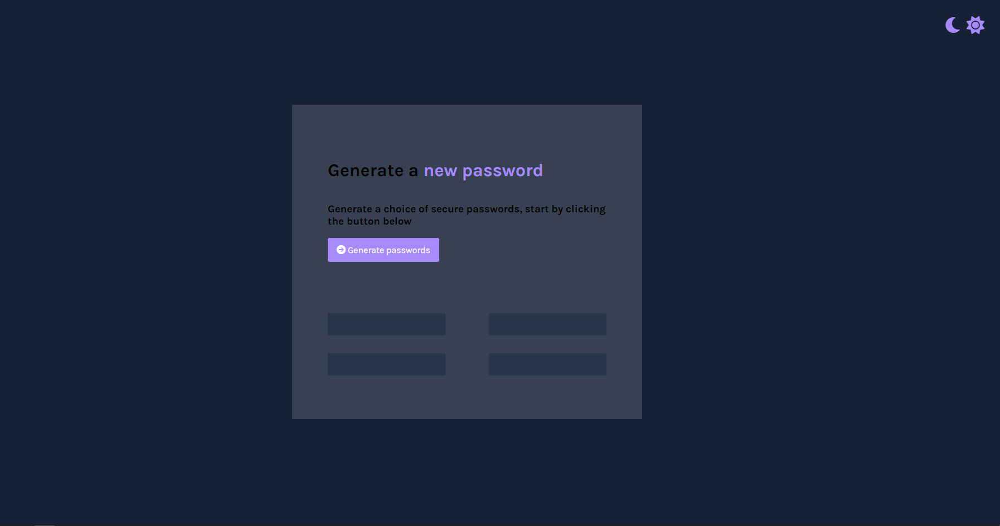

[Live site](https://chloe-o.github.io/password-generator/)

# Password Generator

This project was produced as part of Scrimba's Front End Developer Career Path. By clicking the button a 9-character long password is generator from an array containing lower and uppercase characters as well as symbols and numbers. A for loop, in conjunction with Math.floor and Math.random is used to iterate through the length of the array and return 9 random characters. These are pushed into a new array, turned into a string and displayed in the broswer.

## Credits 

* [Font Awesome](https://fontawesome.com)
* [Google Fonts](https://fonts.google.com/)
